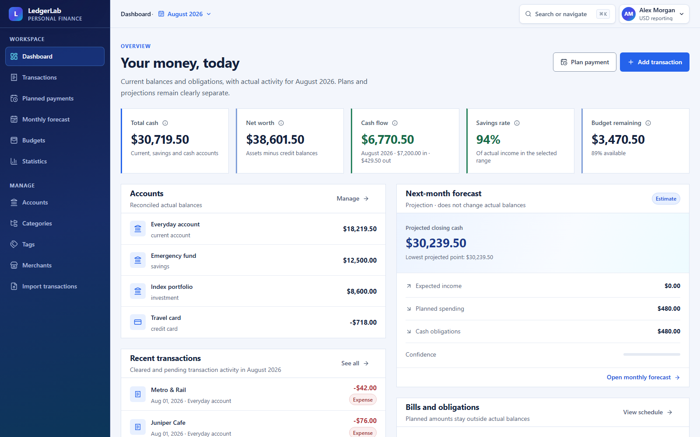
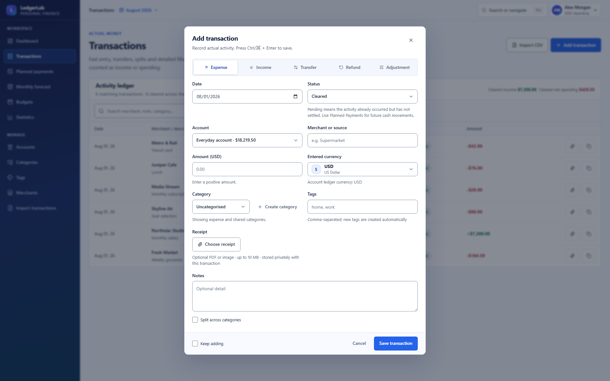
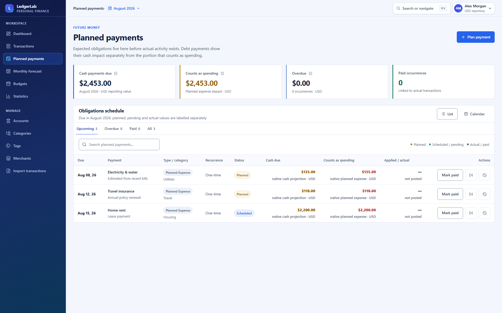
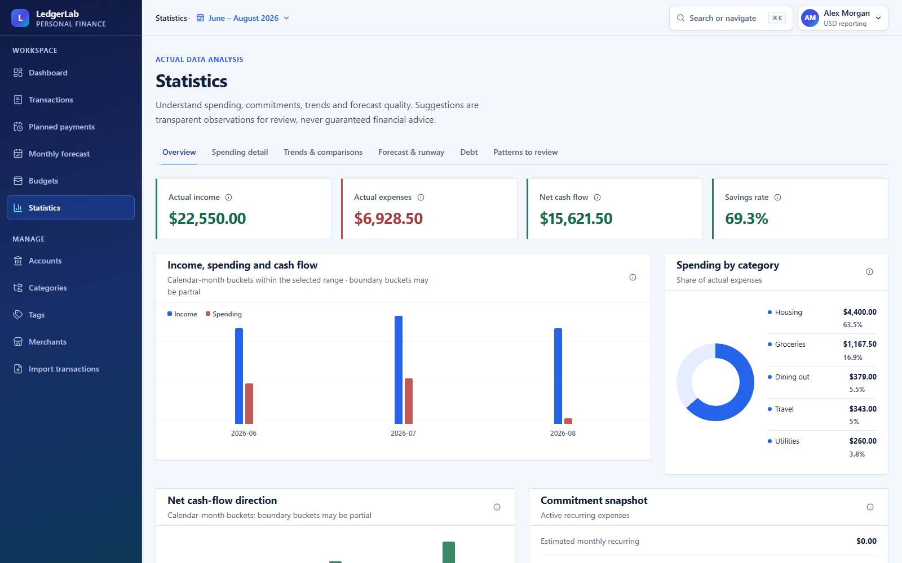
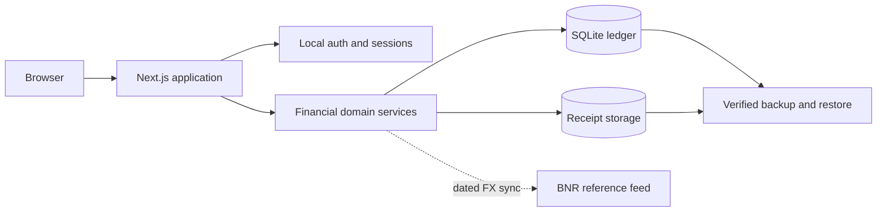

<div align="center">

# LedgerLab

**A self-hosted personal finance workspace for actuals, plans, forecasts, and liabilities.**

Record what happened, prepare what comes next, and understand the difference without handing your financial history to a third-party service.

[](https://github.com/floreabogdan/ledgerlab/actions/workflows/ci.yml)
[](https://github.com/floreabogdan/ledgerlab/pkgs/container/ledgerlab)
[](https://nodejs.org/)
[](LICENSE)
[](https://buymeacoffee.com/floreabogdan)

<br>



<sub>Every person, institution, account, and amount shown in these screenshots is synthetic.</sub>

</div>

---

## What it is

LedgerLab is a self-hosted, multi-account financial workspace that runs as one Next.js application backed by SQLite. It combines the daily ledger with future obligations, monthly scenarios, liabilities, imports, statistics, and backups without pretending those are all the same kind of money.

The central design decision is simple: **actual, pending, planned, and hypothetical values remain separate until a deliberate workflow connects them.** A bill can exist before a transaction. Paying it asks what actually happened, creates the real ledger entry, and keeps the link between expectation and outcome.

That boundary drives the dashboard, forecasts, statistics, account reconciliation, and test suite.

## One workspace, four financial states

| State | What it means | Changes a reconciled balance | Appears in historical actuals |
| --- | --- | ---: | ---: |
| **Actual** | A cleared ledger transaction | Yes | Yes |
| **Pending** | Activity that happened but has not settled | Not until cleared | No |
| **Planned** | An expected future income or obligation | No | No |
| **Scenario** | A what-if assumption inside a monthly forecast | No | No |

Transfers are paired ledger movements, never income or spending. Credit limits are borrowing capacity, never assets. Credit-card repayments and loan principal move value between accounts; only interest and fees count as expenses.

<table>
<tr>
<td width="50%"><br><sub><b>Fast entry with account-aware currency, receipt upload, splits, and keyboard controls.</b></sub></td>
<td width="50%"><br><sub><b>Future obligations stay projected until a payment creates the linked actual transaction.</b></sub></td>
</tr>
<tr>
<td colspan="2"><br><sub><b>Date-range analysis uses actual ledger data and includes calculation explanations for derived metrics.</b></sub></td>
</tr>
</table>

## Read this before you run it

> [!IMPORTANT]
> LedgerLab stores authentication material, financial history, backups, and uploaded receipts. Claim a new installation from a trusted device before exposing it to a network, put HTTPS in front of any remote deployment, and keep verified off-device backups. Start with the [deployment guide](docs/deployment.md) and [security model](SECURITY.md).

> [!NOTE]
> LedgerLab is a record-keeping and planning tool, not a bank, accountant, lender, tax service, or investment adviser. Forecasts and review suggestions are transparent estimates based on the data you entered; they are not guarantees or financial advice.

The default database is empty. Demo data is optional, explicitly seeded, and isolated from real workspaces. LedgerLab has no analytics or application telemetry. Its only application-level outbound requests retrieve National Bank of Romania (BNR) reference rates when a supported conversion needs them.

## Start with Docker

You need a current [Docker Engine](https://docs.docker.com/engine/install/). The named volume below is the durable part of the installation: it keeps the SQLite database, receipt files, and cached exchange-rate observations when the container or image is replaced.

```bash
docker pull ghcr.io/floreabogdan/ledgerlab:latest
docker volume create ledgerlab-data
docker run --detach --name ledgerlab --restart unless-stopped --publish 127.0.0.1:3000:3000 --env REGISTRATION_MODE=first-user --mount source=ledgerlab-data,target=/app/data ghcr.io/floreabogdan/ledgerlab:latest
```

Open <http://localhost:3000> and create the installation owner. `REGISTRATION_MODE=first-user` permits exactly that first account and then closes registration automatically.

The `ledgerlab-data` volume survives `docker stop`, `docker rm`, image pulls, and container rebuilds. **Do not run `docker volume rm ledgerlab-data` unless you intend to permanently erase the installation.** Read [Backups and recovery](docs/backups-and-recovery.md) before an upgrade or move.

<details>
<summary><b>Build the image from source</b></summary>

```bash
docker build --tag ledgerlab:local .
docker volume create ledgerlab-data
docker run --detach --name ledgerlab --restart unless-stopped --publish 127.0.0.1:3000:3000 --env REGISTRATION_MODE=first-user --mount source=ledgerlab-data,target=/app/data ledgerlab:local
```

</details>

<details>
<summary><b>Update without losing data</b></summary>

Create and verify a backup first, then replace only the container:

```bash
docker pull ghcr.io/floreabogdan/ledgerlab:latest
docker stop ledgerlab
docker rm ledgerlab
docker run --detach --name ledgerlab --restart unless-stopped --publish 127.0.0.1:3000:3000 --env REGISTRATION_MODE=first-user --mount source=ledgerlab-data,target=/app/data ghcr.io/floreabogdan/ledgerlab:latest
```

</details>

The loopback-only port binding is intentional. See [Deployment](docs/deployment.md) before placing LedgerLab behind a reverse proxy, changing the bind address, or making it reachable outside the host.

## What works today

**Record and reconcile**

- Current, savings, cash, investment, credit-card, loan, and custom accounts
- Opening balances, native account currencies, balance history, and archive-with-history workflows
- Income, expenses, refunds, adjustments, atomic transfers, split categories, tags, merchants, notes, and receipt uploads
- Fast multi-entry transaction sessions, duplicate detection, rich filters, CSV preview/mapping/import, and CSV/JSON export
- Full installation backup and verified restore, including uploaded receipts and ownership checks

**Plan and forecast**

- One-time and recurring planned payments with deterministic occurrence generation
- Planned, scheduled, overdue, paid, skipped, and cancelled states
- Partial payments, edited actual amounts, linked transactions, skipped occurrences, and undo
- Monthly budgets, fixed/variable and essential/discretionary classification, and planned-versus-actual comparison
- Expected opening balances, account closing forecasts, projected low cash point, scenarios, and previous-month copy
- Credit-card limits, statements, repayments, utilization, and available credit
- Fixed and indexed loans with 1/3/6/12-month reference-rate periods, rate history, schedules, allocation, and recasting

**Understand and operate**

- Date ranges shared across dashboards, transactions, budgets, forecasts, and statistics
- Income, spending, cash flow, savings rate, rolling trends, runway, recurring commitments, concentration, and forecast accuracy
- Category, merchant, account, tag, weekday, week, and month analysis with calculation explanations
- Responsive desktop/mobile layouts, accessible labels, keyboard navigation, loading/error/empty states, and mobile-safe tables
- Profile reporting currency, locale, and IANA time zone without rewriting historical ledgers

## Money and currency model

LedgerLab stores money as integer minor units. Floating-point values never enter balance, transfer, budget, liability, or forecast arithmetic.

Each account has an immutable native ledger currency. A transaction posts in that currency; when the original purchase uses another currency, LedgerLab also preserves the original amount, currency, effective date, applied rate, rate source, and optional reference rate. Cross-currency transfers preserve exact source and destination amounts as paired legs.

The profile currency is a **reporting preference**, not a second ledger. Cross-account totals are converted when read: flows use the transaction date, historical balances use the snapshot date, and current balances use the report's as-of date. Changing the profile currency re-expresses reports without rewriting accounts or transaction history.

BNR publishes RON-anchored reference data, not every possible currency pair. LedgerLab stores downloaded daily observations and can resolve supported pairs through RON. Unsupported pairs and institution-specific rates remain manually editable. A saved transaction keeps the rate that was actually applied, so a future feed update cannot change history.

The interface is currently English. Locale, currency, and time-zone preferences control formatting and calendar behavior; they do not translate interface copy.

Read [Data model and financial invariants](docs/data-model.md) for the complete rules.

## How it is put together



- **One application, one database writer.** LedgerLab is designed for a single Node.js process and a local persistent SQLite filesystem, not serverless functions, shared network storage, or multiple replicas.
- **Server-side financial boundaries.** Authentication, ownership checks, validation, balance writes, payment transitions, FX snapshots, and restore verification live behind the API rather than relying on the browser.
- **Migration-owned schema.** Checked-in Drizzle migrations run idempotently before the application serves financial data.
- **Reproducible delivery.** The production image is multi-stage, runs as an unprivileged user, declares `/app/data` as its only mutable volume, includes a health check, and omits source tests, local data, and development metadata.
- **Evidence in CI.** Every change runs lint, strict TypeScript checks, focused domain/service tests, a production build, complete Playwright workflows, and a hardened container restart/persistence test. Published images include provenance and an SBOM.

## Financial invariants

These are implementation constraints, not documentation promises:

- Account balances reconcile from opening balances and cleared, non-void ledger transactions.
- Transfer legs are atomic and never inflate income or spending.
- Planned occurrences do not affect actual balances or historical statistics.
- Paying a planned occurrence creates and links the real transaction exactly once.
- Recurrence remains deterministic across month/year boundaries and cannot duplicate an existing occurrence.
- Credit limits never increase net worth; loan principal and card repayments never become new spending.
- Reporting conversion failures stay visible rather than adding unlike currencies.
- A profile-currency change never mutates native account or transaction history.

Focused tests cover balances, transfers, recurrence, forecasts, planned-versus-actual calculations, payment transitions, liabilities, FX, reporting currency, attachments, portability, and restore integrity.

## Documentation

- [Getting started](docs/getting-started.md)
- [Configuration](docs/configuration.md)
- [Deployment, Docker, and upgrades](docs/deployment.md)
- [Backups and recovery](docs/backups-and-recovery.md)
- [Data model and financial invariants](docs/data-model.md)
- [Architecture](docs/architecture.md)
- [Troubleshooting](docs/troubleshooting.md)
- [Contributing](CONTRIBUTING.md)
- [Security policy](SECURITY.md)
- [Support](SUPPORT.md)

## Development

Contributors need Node.js 24 LTS and npm 11 or newer.

```bash
npm ci
npm run db:migrate
npm run lint
npm run typecheck -- --incremental false
npm test
npx playwright install chromium
npm run test:e2e
npm run build
```

Playwright uses only the disposable `data/e2e.db` database unless `E2E_BASE_URL` points it at an existing deployment. It never recreates `data/ledgerlab.db`. Read [CONTRIBUTING.md](CONTRIBUTING.md) before opening a pull request.

Never attach a real database, backup, bank export, receipt, access token, password, session cookie, or unredacted financial screenshot to a public issue.

## Contributors and support

Built and maintained by **Bogdan Florea**. Contributions are welcome through focused issues and pull requests.

If LedgerLab is useful to you, you can [buy me a coffee](https://buymeacoffee.com/floreabogdan). For bugs, feature proposals, usage questions, and security reports, start with [SUPPORT.md](SUPPORT.md) so the request reaches the right channel.

## License

LedgerLab is licensed under the [GNU Affero General Public License version 3.0 only](LICENSE) (`AGPL-3.0-only`). You may run, study, modify, and redistribute it, including commercially, under that license's terms. If you make a modified version available to users over a network, the AGPL requires you to offer those users its corresponding source code under the same license.

See [NOTICE](NOTICE) for project attribution. The license text controls if this summary and the license differ.
